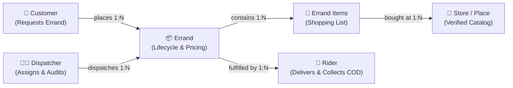

# Capstone Project: Conceptual Database Model & ERD Specification

> **Document Type:** System Architecture & Database Design Specification  
> **Target Audience:** Capstone Advisers, Defense Panelists, System Developers  
> **Workspace:** `Capstone_Project_Web` / `Capstone_Server` / `Capstone_Project_Mobile_App`  

---

## 1. Executive Summary & Overview

The **Conceptual Database Model** represents the technology-independent blueprint of the Capstone Errand Delivery System. It abstracts the real-world business entities, their descriptive attributes, and their operational relationships without the constraints of specific DBMS storage engines.

The architecture is split into two complementary presentation views:
1. **Core Presentation View (5-Entity High-Level Model)**: Designed for slide presentations and quick conceptual comprehension by non-technical stakeholders.
2. **Comprehensive Production View (24-Entity 3NF Model)**: Designed for technical appendices, detailed data governance, dispute resolution, offline GPS buffering, and receipt OCR audit trails.

---

## 2. Level 1: Simplified Core Conceptual Model (Defense Presentation)

For slide presentations and Chapter 3 overview diagrams, the core errand workflow revolves around **5 primary entities**:

### Core Business Flow:
1. **Customer**: Submits an errand request with items and delivery pinpoints.
2. **Dispatcher**: Reviews the request via live chat, calculates transparent rates, and assigns a verified rider.
3. **Rider**: Traverses the sequenced store stops, purchases goods, captures photographic receipts, and delivers to the customer with Cash-on-Delivery (COD).

---

## 3. Level 2: Full Comprehensive Conceptual ERD (Mermaid Diagram)

*Tip: You can copy this Mermaid block directly into [Mermaid Live Editor](https://mermaid.live) to download as high-resolution PNG, SVG, or PDF for your manuscript.*

```mermaid
erDiagram
    %% DOMAIN 1: IDENTITY & ACTORS
    USER ||--o| RIDER_PROFILE_PHOTO : "has"
    USER ||--o| RIDER_PRESENCE : "reports"
    USER ||--o{ RIDER_LOGIN_SESSION : "logs"
    USER ||--o{ RIDER_STATUS_LOG : "records"
    CUSTOMER_ACCOUNT ||--|| CUSTOMER_INFORMATION : "owns"
    CUSTOMER_ACCOUNT ||--o| CUSTOMER_PROFILE_PHOTO : "has"
    CUSTOMER_ACCOUNT ||--o{ SAVED_DELIVERY_LOCATION : "saves"
    CUSTOMER_ACCOUNT ||--o{ PASSWORD_RESET_ATTEMPT : "attempts"

    %% DOMAIN 2 & 3: ERRAND LIFECYCLE & DISPATCH
    CUSTOMER_ACCOUNT ||--o{ ERRAND : "requests (1:N)"
    USER ||--o{ ERRAND : "fulfills as Rider (1:N)"
    USER ||--o{ DISPATCH_LOG : "claims as Dispatcher (1:N)"
    ERRAND ||--o{ DISPATCH_LOG : "tracked by"
    ERRAND ||--o{ ERRAND_DECLINE_REASON : "records declines"
    USER ||--o{ ERRAND_DECLINE_REASON : "declined by"

    %% ERRAND ITEMS & STORE STOPS
    ERRAND ||--o{ PABILI_ITEM_REQUEST : "contains original ask (1:N)"
    ERRAND ||--o{ PABILI_DETAIL : "contains working items (1:N)"
    ERRAND ||--o{ ERRAND_PINPOINT : "visits store waypoints (1:N)"
    ERRAND_PINPOINT ||--o{ PABILI_DETAIL : "allocates items to stop (1:N)"
    ERRAND_PINPOINT ||--o{ PABILI_ITEM_REQUEST : "matches request (1:N)"

    %% MERCHANTS & VERIFIED PLACES
    MERCHANT_CATEGORY ||--o| STORE_CATEGORY_IMAGE : "has hero photo"
    MERCHANT_CATEGORY ||--o{ VERIFIED_PLACE : "categorizes (1:N)"
    VERIFIED_PLACE ||--o{ ERRAND_PINPOINT : "pinned as store (1:N)"
    VERIFIED_PLACE ||--o{ DWELL_OBSERVATION : "measures stop time (1:N)"
    ERRAND_PINPOINT ||--o{ DWELL_OBSERVATION : "generates dwell"

    %% DOMAIN 4: FINANCIALS & SETTLEMENT
    RATE_CONFIG ||..|| ERRAND : "prices via formula"
    ERRAND ||--o| PAYMENT_SELECTION : "confirms mode (1:1)"
    PAYMENT_MODE ||--o{ PAYMENT_SELECTION : "applies to"
    PAYMENT_MODE ||--o{ ERRAND : "selected on"
    ERRAND ||--o| CUSTOMER_TRANSACTION : "bills customer (1:1)"
    ERRAND ||--o| SETTLEMENT_RECORD : "reconciles COD (1:1)"
    ERRAND ||--o| RIDER_COMMISSION : "calculates payout (1:1)"

    %% DOMAIN 5: PROOF, OCR & EXCEPTIONS
    ERRAND ||--o{ ERRAND_PROOF_IMAGE : "photographs proof (1:N)"
    ERRAND_PINPOINT ||--o{ ERRAND_PROOF_IMAGE : "attaches receipt (1:N)"
    ERRAND_PROOF_IMAGE ||--o| RECEIPT_EXTRACTION : "processes via OCR (1:1)"
    ERRAND ||--o{ EXCEPTION_REVIEW : "flags & clears (1:N)"
    USER ||--o{ EXCEPTION_REVIEW : "reviewed by staff (1:N)"

    %% DOMAIN 6: TELEMETRY, AUDIT & NOTIFICATIONS
    ERRAND ||--o{ ERRAND_TRACK_POINT : "records breadcrumbs (1:N)"
    USER ||--o{ ERRAND_TRACK_POINT : "generated by Rider (1:N)"
    USER ||--o{ CONNECTIVITY_INCIDENT : "logs signal loss (1:N)"
    ERRAND ||--o| RATING : "receives review (1:1)"
    USER ||--o{ NOTIFICATION : "receives alert (1:N)"
    CUSTOMER_ACCOUNT ||--o{ NOTIFICATION : "receives alert (1:N)"
```

---

## 4. Detailed Data Dictionary (6 Functional Domains)

### Domain 1: Identity & Access Management (IAM)

| Entity | Description | Key Attributes | Cardinality |
|---|---|---|---|
| **`User`** | Operational personnel (`OWNER`, `DISPATCHER`, `RIDER`). | `username`, `passwordHash`, `role`, `firstName`, `lastName`, `email`, `phone`, `status`, `expoPushToken` | $1:N$ to Errands, Logs |
| **`CustomerAccount`** | Customer authentication and credentials. | `username`, `passwordHash`, `email`, `emailVerified`, `status`, `expoPushToken` | $1:1$ to Information, $1:N$ to Errands |
| **`CustomerInformation`** | Customer demographic and profile details. | `firstName`, `middleName`, `lastName`, `birthdate`, `phone` | $1:1$ with `CustomerAccount` |
| **`SavedDeliveryLocation`** | Customer saved map pinpoints (Home, Work, etc., max 5). | `label`, `address`, `latitude`, `longitude`, `isDefault` | $N:1$ to `CustomerAccount` |
| **`UserSession`** | Cryptographic 30-day rotating refresh session tokens. | `tokenHash` (SHA-256), `previousHash`, `deviceId`, `ipAddress`, `expiresAt` | $N:1$ to Subject |

---

### Domain 2: Errand Request, Pinpoints & Fulfillment

| Entity | Description | Key Attributes | Cardinality |
|---|---|---|---|
| **`Errand`** | Master lifecycle transaction record. | `category`, `pickupAddress`, `deliveryAddress`, `status`, `deliveryFee`, `totalCost`, `distanceKm`, `etaLowAt`, `etaHighAt` | $1:N$ to Items, Stops |
| **`PabiliItemRequest`** | Customer's immutable original requested items. | `itemName`, `storeCategory`, `quantity` | $N:1$ to `Errand` |
| **`PabiliDetail`** | Working shopping checklist editable by dispatchers. | `itemName`, `quantity`, `unitPrice`, `estimatedSubtotal`, `pinpointId` | $N:1$ to `Errand`, $N:1$ to `ErrandPinpoint` |
| **`ErrandPinpoint`** | Sequenced store waypoints visited by the rider (1 to 3). | `sequence`, `storeName`, `latitude`, `longitude`, `arrivedAt`, `departedAt` | $N:1$ to `Errand` |
| **`DispatchLog`** | Audit trail of dispatcher claims and assignments. | `dispatcherId`, `errandId`, `notes`, `dispatchedAt` | $N:1$ to `Errand`, $N:1$ to `User` |
| **`ErrandDeclineReason`** | Documented reason when a dispatcher turns down an order. | `reason`, `isCustom`, `createdAt` | $N:1$ to `Errand` |

---

### Domain 3: Merchants, Places & Dwell Learning

| Entity | Description | Key Attributes | Cardinality |
|---|---|---|---|
| **`MerchantCategory`** | Store types with specialized fee modes and dwell stats. | `name`, `handlingFeeMode`, `dwellP50Seconds`, `dwellP80Seconds`, `geofenceRadiusMeters` | $1:N$ to Verified Places |
| **`VerifiedPlace`** | Catalog of verified Tacurong City business coordinates. | `name`, `categoryId`, `address`, `barangay`, `latitude`, `longitude`, `isActive` | $N:1$ to `MerchantCategory` |
| **`DwellObservation`** | Machine learning observations of stop dwell times. | `dwellSeconds`, `arrivedAt`, `departedAt`, `stalled` | $N:1$ to `ErrandPinpoint`, `VerifiedPlace` |

---

### Domain 4: Pricing, Billing & Financial Settlements

| Entity | Description | Key Attributes | Cardinality |
|---|---|---|---|
| **`RateConfig`** | Business pricing parameters configured by Owner. Singleton row (`id = 1`). | `baseFee`, `perKmRate`, `multiStoreFeePerStore`, `maxAdditionalStores`, `groceryFeeThreshold`, `groceryFeePercent`, `groceryFeeFlat`, `nonCodThreshold`, `nonCodFeeHigh`, `nonCodFeeLow` | Global Configuration |
| **`CustomerTransaction`** | Customer transaction bill and payment ledger. | `amount`, `paymentMethod` (COD), `status`, `paidAt` | $1:1$ with `Errand` |
| **`PaymentSelection`** | Dispatcher-enabled, customer-confirmed payment choice. Immutable once written. | `paymentModeId`, `confirmedAt` | $1:1$ with `Errand` |
| **`ErrandPayment`** | Append-only ledger of money that arrived outside the system (Facebook Page), each row naming the staff member who vouched for it. Covers the 50% downpayment plan and the fully-prepaid modes. | `kind` (`UPFRONT` / `TOP_UP` / `FINAL` / `REFUND`), `amount`, `confirmedByUserId`, `confirmedAt`, `note` | $1:N$ with `Errand` |
| **`SettlementRecord`** | End-of-day COD cash reconciliation and shortage audits. | `expectedAmount`, `collectedAmount`, `variance`, `status`, `shortReason` | $1:1$ with `Errand` |
| **`RiderCommission`** | Transparent earnings split calculation per completed errand. | `deliveryFee`, `tip`, `riderShare`, `businessShare`, `itemCostExcluded` | $1:1$ with `Errand` |

---

### Domain 5: Photographic Evidence, OCR & Audit

| Entity | Description | Key Attributes | Cardinality |
|---|---|---|---|
| **`ErrandProofImage`** | Photographic proof (receipts, delivery handover). | `kind` (`RECEIPT`, `PROOF_OF_DELIVERY`, `NO_RECEIPT`), `clarityVerdict`, `declaredTotal` | $N:1$ to `Errand` |
| **`ReceiptExtraction`** | Optical Character Recognition (OCR) extracted data. | `engine` (MLKit/CloudVision), `extractedTotal`, `confidence`, `confirmedTotal` | $1:1$ with `ErrandProofImage` |
| **`ExceptionReview`** | Formal staff clearance of financial/operational disputes. | `kind`, `reviewerId`, `reason`, `amountAtRisk`, `resolvedAt` | $N:1$ to `Errand`, `User` |

---

### Domain 6: Telemetry, Breadcrumbs & Notifications

| Entity | Description | Key Attributes | Cardinality |
|---|---|---|---|
| **`ErrandTrackPoint`** | Map-matched GPS breadcrumb trail uploaded by riders. | `latitude`, `longitude`, `speedMps`, `recordedAt`, `receivedAt`, `isMapMatched` | $N:1$ to `Errand`, `User` |
| **`ConnectivityIncident`** | Audit logs of rider device signal drops during deliveries. | `disconnectedAt`, `reconnectedAt` | $N:1$ to `User` |
| **`Rating`** | Customer 5-star rating and feedback for the rider. | `stars` (1–5), `comment`, `createdAt` | $1:1$ with `Errand` |
| **`Notification`** | Multi-channel in-app push and status notification records. | `type`, `title`, `body`, `isRead`, `createdAt` | $N:1$ to `User` or `CustomerAccount` |

---

## 5. Defense Panelist Q&A Cheatsheet

### Q1: "Why is your database so large compared to typical student projects?"
> **Answer:** *"Our database implements strict Third Normal Form (3NF) and enterprise data governance. Instead of unnormalized god-tables, we deliberately separated mutable working data from immutable audit records (e.g. `PabiliItemRequest` vs `PabiliDetail`), built automated COD cash reconciliation (`SettlementRecord`), and included offline GPS breadcrumb buffering (`ErrandTrackPoint`) to ensure real-world reliability."*

### Q2: "What is the difference between your Conceptual Model and your Logical/Physical Model?"
> **Answer:** *"The Conceptual Model defines our 6 core business domains, business rules, and entity relationships in a technology-independent manner. The Logical Model maps these to 3NF relational schemas with explicit Primary/Foreign Keys, and the Physical Model implements them in MariaDB with Prisma ORM data types, indexes, and constraints."*
